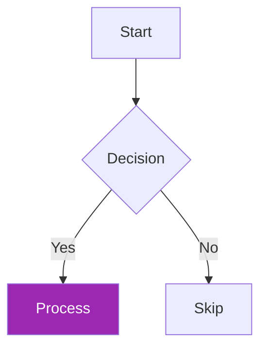
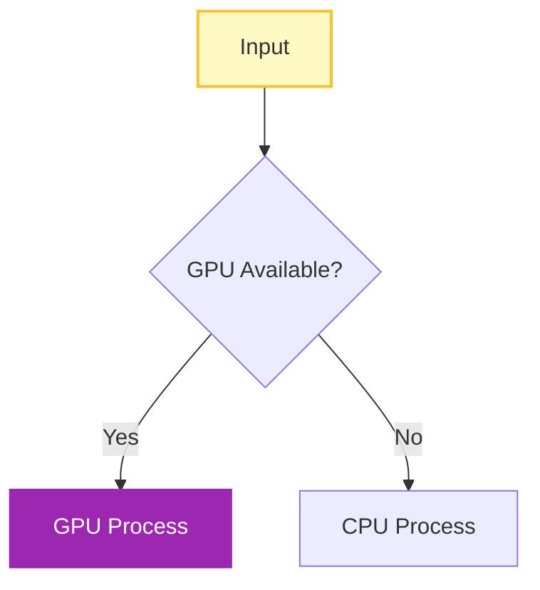

# Documentation Maintenance Guide

This guide explains how the documentation is structured and how to keep it updated.

## Overview

The nf-proteindesign documentation uses [MkDocs](https://www.mkdocs.org/) with the [Material theme](https://squidfunk.github.io/mkdocs-material/). It includes **automatic content generation** for parameters and version information.

## Dynamic Content

### Auto-Generated Parameter Documentation

The file `docs/reference/parameters.md` is **automatically generated** from `nextflow_schema.json`:

```bash
# Manually regenerate parameter docs
python3 bin/generate_parameter_docs.py
```

**When building docs**, this happens automatically via the MkDocs hook (`docs/hooks/update_dynamic_content.py`).

### Version Information

Pipeline version is automatically extracted from `nextflow.config` and displayed in documentation badges.

## Updating Documentation

### 1. Update Workflow Diagrams

Workflow diagrams use [Mermaid](https://mermaid.js.org/) syntax and are embedded in markdown files:

- **Main workflow**: `docs/index.md`
- **Detailed architecture**: `docs/architecture/design.md`
- **ProteinMPNN/Boltz-2 workflow**: `docs/analysis/proteinmpnn-boltz2.md`

#### Mermaid Diagram Best Practices



- Use `TB` (top-bottom) for vertical flow
- Use `LR` (left-right) for horizontal flow
- Add line breaks in nodes: `[Text<br/>More Text]`
- Style important nodes with pipeline colors (purple theme)

### 2. Update Parameters

**Don't edit** `docs/reference/parameters.md` directly! Instead:

1. Update `nextflow_schema.json` with new parameters
2. Run `python3 bin/generate_parameter_docs.py` to regenerate
3. Or just build the docs - it auto-updates

### 3. Update Process Information

Edit `docs/architecture/design.md` to add/modify:

- Process descriptions in the table
- Module structure in the tree diagram
- Execution flow details

### 4. Build and Preview

```bash
# Install dependencies (first time only)
pip install -r requirements.txt

# Preview documentation locally
mkdocs serve

# Build static site
mkdocs build

# Deploy to GitHub Pages (if configured)
mkdocs gh-deploy
```

The docs will be available at `http://127.0.0.1:8000/`

## Documentation Structure

```
docs/
├── index.md                          # Home page with overview
├── quick-start.md                    # Quick start guide
├── getting-started/
│   ├── installation.md               # Installation instructions
│   ├── usage.md                      # Basic usage guide
│   └── quick-reference.md            # Quick reference
├── analysis/
│   ├── proteinmpnn-boltz2.md        # ProteinMPNN & Boltz-2 workflow
│   ├── ipsae.md                      # ipSAE scoring
│   ├── prodigy.md                    # PRODIGY binding affinity
│   ├── foldseek.md                   # Foldseek structural search
│   └── consolidation.md              # Metrics consolidation
├── architecture/
│   ├── design.md                     # Pipeline architecture (WORKFLOWS HERE!)
│   └── implementation.md             # Implementation details
├── reference/
│   ├── parameters.md                 # AUTO-GENERATED from schema
│   ├── outputs.md                    # Output file descriptions
│   └── examples.md                   # Usage examples
├── deployment/
│   └── github-pages.md               # GitHub Pages deployment
└── hooks/
    └── update_dynamic_content.py     # Pre-build hook for dynamic content
```

## Mermaid Diagram Colors

Use the pipeline's color scheme for consistency:

```css
Primary Purple: #9C27B0
Lighter Purple: #8E24AA
Medium Purple: #7B1FA2
Dark Purple: #6A1B9A

GPU Process: #E1BEE7 (light purple fill)
CPU Process: #F3E5F5 (very light purple fill)
Data Nodes: #FFF9C4 (yellow fill)
Decision Nodes: #FFF3E0 (orange tint)
```

### Example Diagram with Styling



## Tips for Documentation Writers

1. **Keep diagrams updated**: When you change the workflow, update ALL related diagrams
2. **Use consistent terminology**: "Boltzgen" not "BoltzGen", "Boltz-2" not "Boltz2"
3. **Add info boxes** for important notes:
   ```markdown
   !!! info "Title"
       Your content here
   
   !!! warning "Warning"
       Important warning
   
   !!! tip "Pro Tip"
       Helpful tip
   ```

4. **Cross-reference pages**: Use relative links: `[text](../path/to/page.md)`
5. **Test locally**: Always run `mkdocs serve` to preview changes

## Automated Updates

The documentation includes automation for:

- ✅ **Parameter documentation**: Auto-generated from schema
- ✅ **Version badges**: Auto-extracted from config
- ✅ **Pre-build hooks**: Updates content before building

## Adding New Pages

1. Create markdown file in appropriate directory
2. Update `mkdocs.yml` nav section:
   ```yaml
   nav:
     - Section Name:
       - Page Title: path/to/file.md
   ```

## Questions?

For documentation issues or suggestions, open an issue on GitHub or contact the maintainers.

---

**Last Updated**: Auto-generated on build  
**Documentation Version**: Matches pipeline version from `nextflow.config`
